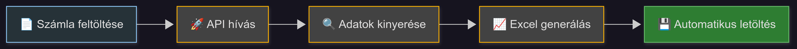
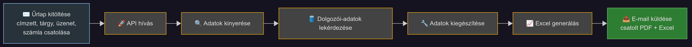
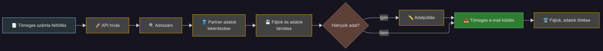

## Stack

- 🐍 **Backend:** FastAPI (Python)
- ⚛️ **Frontend:** Next.js 15 (React, SSR)
- 🛢️ **Adatbázis:** Azure SQL
- 📦 **Fájltárolás:** Azure Blob Storage
- 📧 **E-mail küldés:** Azure Communication Services
- ☁️ **Hosztolás:** Azure App Service

## Fő funkciók

- Számlafeldolgozás, adatkinyerés, export
- Adatbővítés és partnerkezelés
- Tömeges küldés, csatolmánykezelés
- Vizualizáció, jogosultságkezelés

## Folyamatábrák

### 1. Számla feldolgozás és letöltés

### 2. Számla feldolgozás adatbővítéssel

### 3. Számla feldolgozás és e-mail küldés

### 4. Tömeges feldolgozás, küldés és törlés

