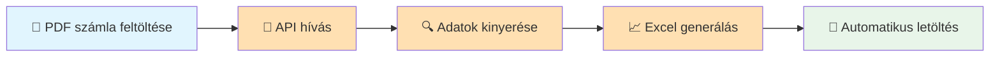
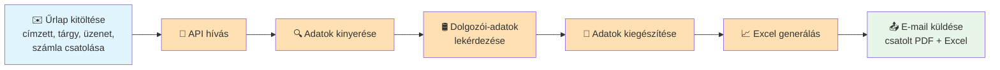
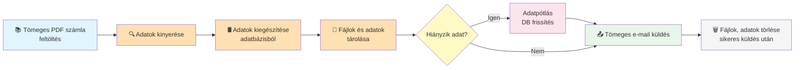

## Stack

- 🐍 **Backend:** [FastAPI (Python)](https://fastapi.tiangolo.com/)  
Python alapú, webes API-fejlesztő keretrendszer

- ⚛️ **Frontend:** [Next.js 15 (React, SSR)](https://nextjs.org/)  
React-alapú frontend keretrendszer modern webes felületek létrehozásához

- 🛢️ **Adatbázis:** [Azure SQL](https://learn.microsoft.com/en-us/azure/azure-sql/?view=azuresql)  
Felhőalapú relációs adatbázis, magas rendelkezésre állással és teljesítménnyel

- 📦 **Fájltárolás:** [Azure Blob Storage](https://learn.microsoft.com/en-us/azure/storage/blobs/storage-blobs-introduction)  
Felhőalapú objektumtároló strukturálatlan adatok számára

- 📧 **E-mail küldés:** [Azure Communication Services](https://learn.microsoft.com/en-us/azure/communication-services/quickstarts/email/send-email?tabs=windows%2Cconnection-string%2Csend-email-and-get-status-async%2Csync-client&pivots=programming-language-python)  
Nagy mennyiségű tranzakciós, tömeges és marketing e-mailek küldését támogató szolgáltatás

- ☁️ **Hosztolás:** [Azure App Service](https://learn.microsoft.com/en-us/azure/app-service/overview)  
Felhőalapú platform webalkalmazások, API-k és háttérrendszerek hosztolásához
---
## Fő funkciók

- Számlák feltöltése, tárolása és automatikus adatkinyerés
- Feldolgozott adatok exportálása (Excel)
- Tömeges e-mail küldés, csatolmányok kezelése
- Adatvizualizáció és jogosultságkezelés
---
## Folyamatábrák

### 1. Számla feldolgozás és letöltés

### 2. Számla feldolgozás adatbővítéssel

```mermaid
flowchart LR
    A[📄 PDF számla feltöltése] --> B[🚀 API hívás]
    B --> C[🔍 Adatok kinyerése]
    C --> D[🛢️ Adatbázis lekérdezése]
    D --> E[🔧 Adatok kiegészítése]
    E --> F[📈 Excel generálás]
    F --> G[💾 Automatikus letöltés]
    
    style A fill:#e1f5fe
    style B fill:#ffe0b2
    style C fill:#ffe0b2
    style D fill:#ffe0b2
    style E fill:#ffe0b2
    style F fill:#ffe0b2
    style G fill:#e8f5e9 
```

### 3. Számla feldolgozás és e-mail küldés

### 4. Tömeges feldolgozás, küldés és törlés

